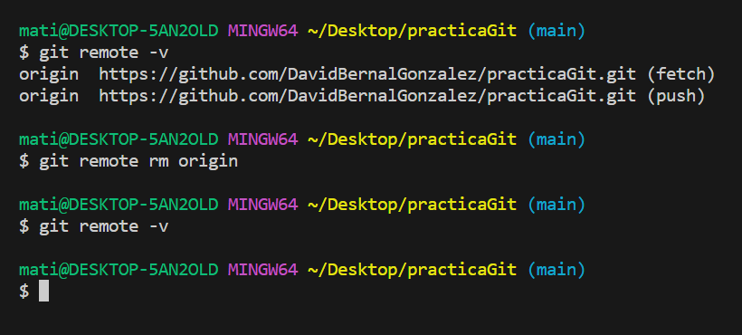
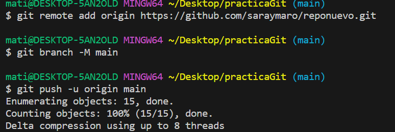

# Práctica
## Ejercicio de Git bash
1. Clona el repositorio https://github.com/DavidBernalGonzalez/practicaGit.git
   >Clonamos con git clone + enlace del repositorio.

2. Visualiza las distintas ramas que hay en el repositorio.
   >Visualizamos las ramas con "git branch -a" para visualizar las ramas que estan en local y en remoto.

3. Dentro del repositorio hay una carpeta llamada practica01, la encontrarás en la rama “practica01”. Sitúate en rama "practica01" para ver la carpeta practica01.
   >Entramos en la rama "practica01" y hacemos ls para ver los archivos.

4. Sitúate en el directorio practica1 y edita los archivos a tu gusto. Una vez editados los ficheros, haz un git status para ver que ha pasado con los ficheros. Finalmente, haz un commit para subir los cambios al repositorio local.
    > Editamos los 3 ficheros que hay, vemos con git status que estan modificados y hacemos "git commit -am "...".

5. Crea una rama nueva, llámala practica1_APELLIDOS_NOMBRE
   > Creamos una nueva rama con git branch + nombre de la rama. 

6. Muévete a la rama que has creado (practica1_APELLIDOS_NOMBRE)
    > Entramos en la rama con git checkout + nombre de la rama.

7. En el directorio raíz, crea el fichero practica1_APELLIDOS_NOMBRE.txt y cualquier cosa en su interior. Y haz un commit de los cambios.
   > Creamos, editamos el fichero y hacemos commit.

8. ¡Nos hemos equivocado! Queremos que en el interior del fichero practica1_APELLIDOS_NOMBRE.txt tendremos que poner nuestro nombre y apellidos. Vuelve a hacer otro commit revirtiendo los cambios (haciendo un nuevo commit) y sube los cambios al repositorio remoto ¿Qué está pasando? ¿Cómo lo solucionarias? ¿Tienes los permisos para escribir en dicho repositorio? ¿Existe posibilidad de arreglarlo? 
    TIP: Elimina el remote actual y añade el de un remote de un repositorio nuevo en tu cuenta ya así si que tendrás permisos para escribirlo
    > 
    Para eliminar el repositorio actual, tal y como se ve en la foto, primero lo hemos visualizado con "git remote -v" y para eliminarlo hemos ejecutado "git remote rm origin". Volvemos a visualizarlo con "git remote -v" y vemos que ha desaparecido.
    
    Creamos el nuevo repositorio y ya se puede subir correctamente.

9.  Vuelve a la rama “practica1”.
    Volvemos a la rama haciendo "git checkout practica1".

10. Haz un merge de tu rama (practica1_APELLIDOS_NOMBRE) con practica1.